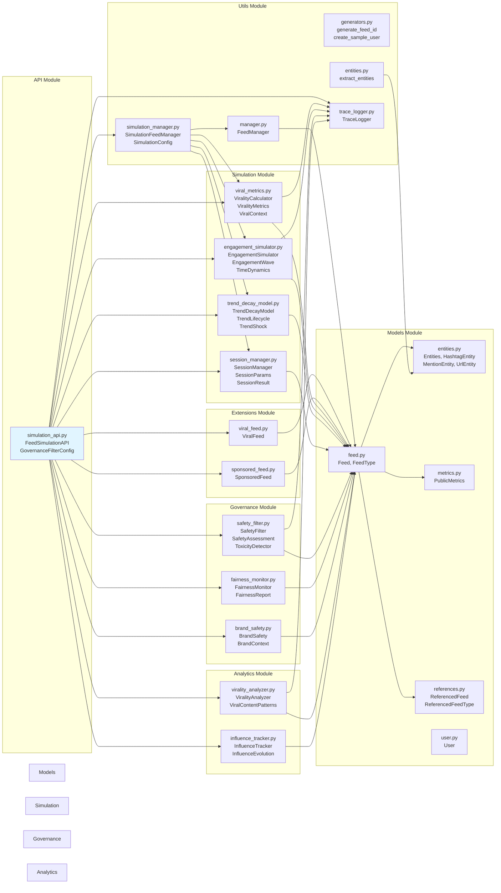
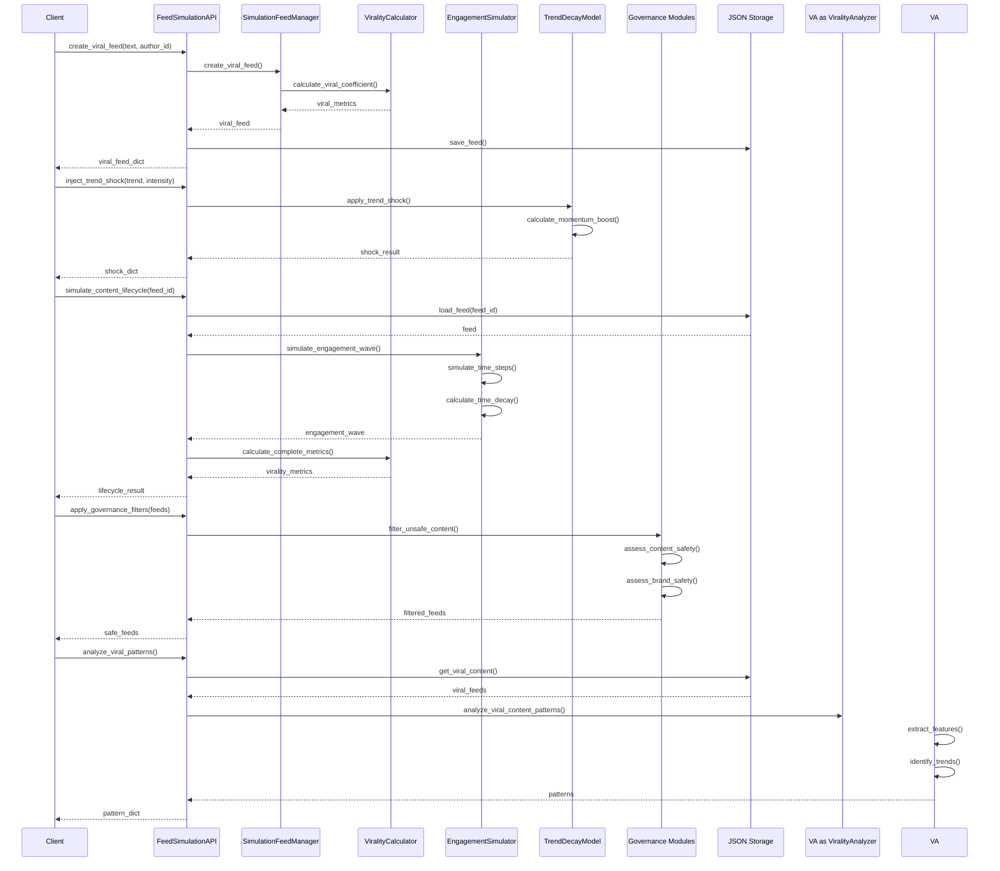
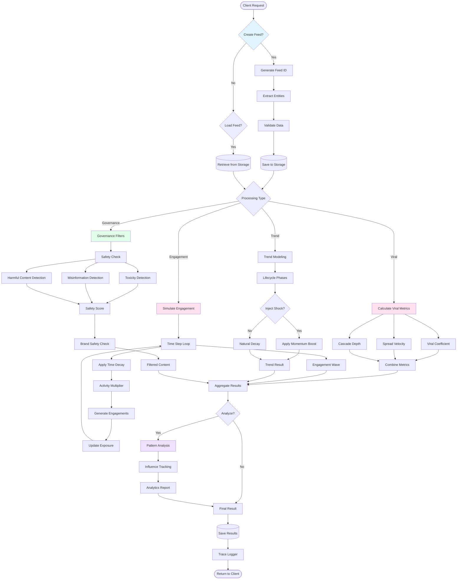
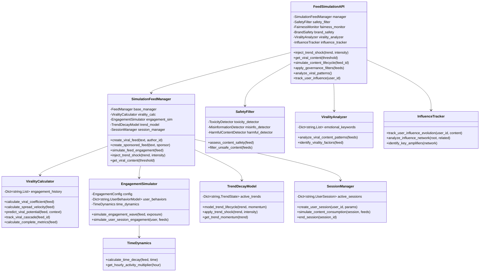
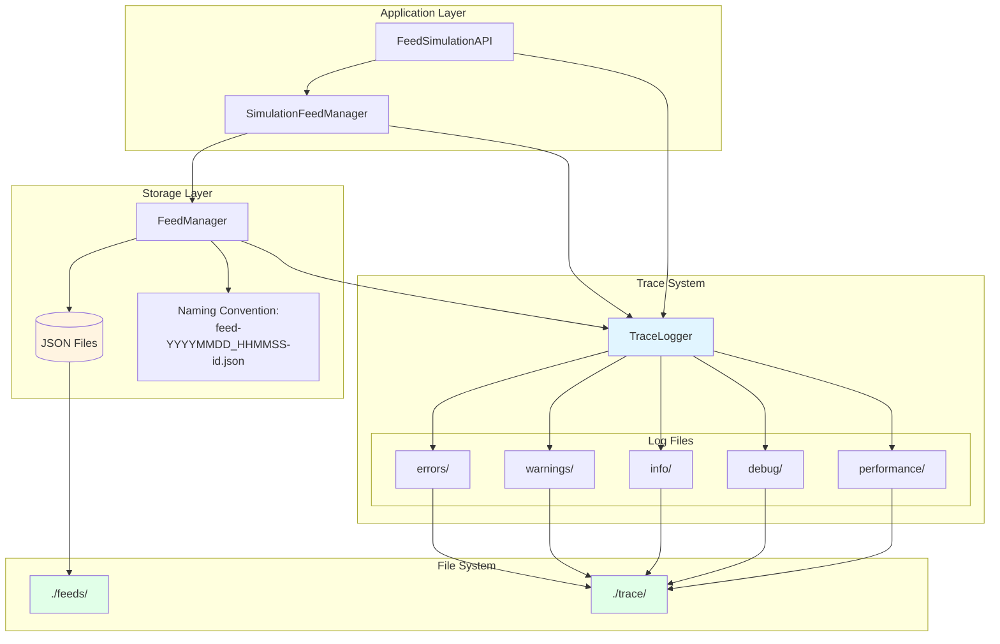
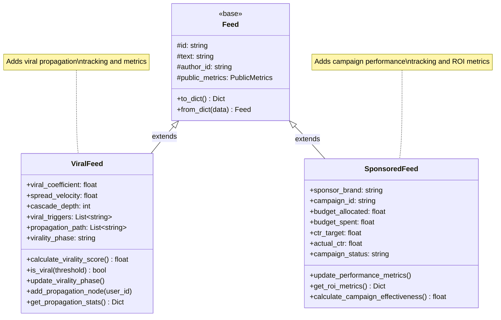
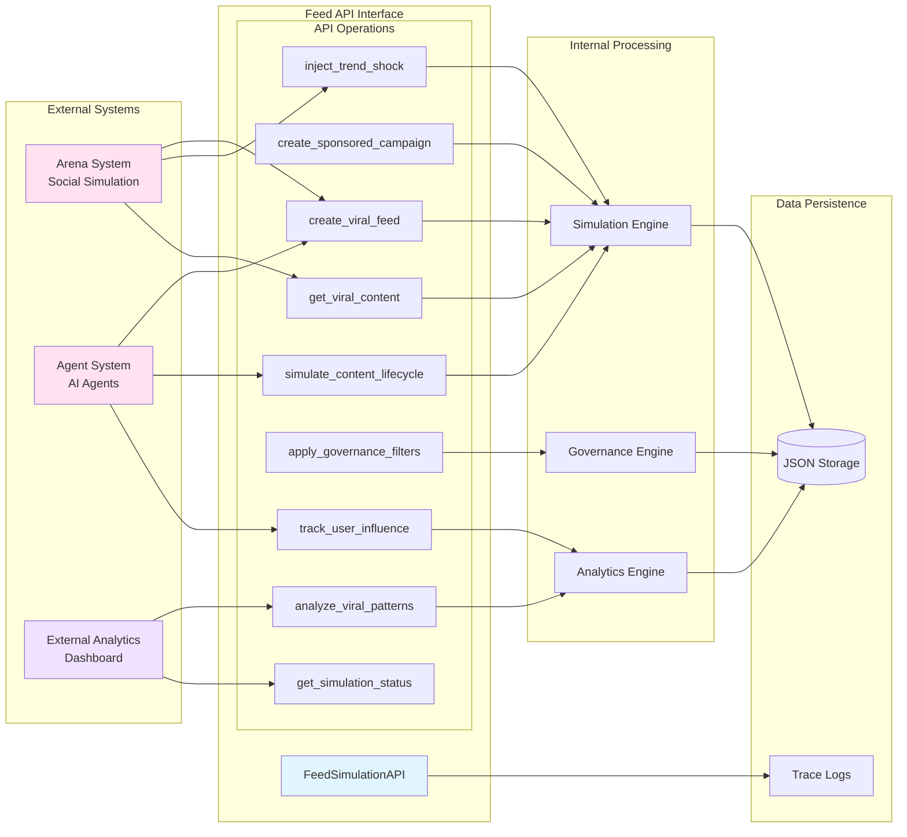

# Feed System Architecture

**Software Engineering Architecture Documentation**

This document provides comprehensive Mermaid diagrams representing the Feed system architecture from multiple perspectives.

---

## 1. System Overview - Layered Architecture

```mermaid
graph TB
    subgraph "External Integrations"
        Arena[Arena System]
        Agent[Agent System]
        External[External Applications]
    end

    subgraph "API Layer"
        API[FeedSimulationAPI]
        Config[GovernanceFilterConfig]
    end

    subgraph "Extension Layer"
        ViralFeed[ViralFeed Extension]
        SponsoredFeed[SponsoredFeed Extension]
    end

    subgraph "Core Layer"
        Models[Core Models]
        FeedManager[FeedManager]
        Utils[Utilities]
    end

    subgraph "Simulation Layer"
        ViralMetrics[Viral Metrics]
        Engagement[Engagement Simulator]
        Trend[Trend Decay Model]
        Session[Session Manager]
    end

    subgraph "Governance Layer"
        Safety[Safety Filter]
        Fairness[Fairness Monitor]
        Brand[Brand Safety]
    end

    subgraph "Analytics Layer"
        ViralityAnalyzer[Virality Analyzer]
        InfluenceTracker[Influence Tracker]
    end

    subgraph "Infrastructure"
        Storage[(JSON Storage)]
        Trace[Trace Logger]
    end

    Arena --> API
    Agent --> API
    External --> API

    API --> Extension Layer
    API --> Simulation Layer
    API --> Governance Layer
    API --> Analytics Layer

    Extension Layer --> Core Layer
    Simulation Layer --> Core Layer
    Governance Layer --> Core Layer
    Analytics Layer --> Core Layer

    Core Layer --> Infrastructure
    API --> Infrastructure

    style API fill:#e1f5ff
    style Core Layer fill:#fff4e1
    style Simulation Layer fill:#ffe1f0
    style Governance Layer fill:#e1ffe8
    style Analytics Layer fill:#f0e1ff
```

---

## 2. Core Data Models - Entity Relationship

```mermaid
classDiagram
    class Feed {
        +string id
        +string text
        +string author_id
        +string created_at
        +FeedType feed_type
        +string conversation_id
        +string in_reply_to_user_id
        +List~ReferencedFeed~ referenced_feeds
        +Entities entities
        +PublicMetrics public_metrics
        +string lang
        +string source
        +bool possibly_sensitive
        +string platform
        +to_dict() Dict
        +from_dict(data) Feed
    }

    class FeedType {
        <<enumeration>>
        POST
        REPLY
        QUOTE
        RETWEET
        THREAD
    }

    class Entities {
        +List~HashtagEntity~ hashtags
        +List~MentionEntity~ mentions
        +List~UrlEntity~ urls
        +to_dict() Dict
    }

    class HashtagEntity {
        +int start
        +int end
        +string tag
    }

    class MentionEntity {
        +int start
        +int end
        +string username
        +string id
    }

    class UrlEntity {
        +int start
        +int end
        +string url
        +string expanded_url
        +string display_url
        +string title
        +string description
    }

    class PublicMetrics {
        +int retweet_count
        +int reply_count
        +int like_count
        +int quote_count
        +int bookmark_count
        +int impression_count
    }

    class ReferencedFeed {
        +string type
        +string id
    }

    class ReferencedFeedType {
        <<enumeration>>
        RETWEETED
        QUOTED
        REPLIED_TO
    }

    class User {
        +string id
        +string username
        +string name
        +string profile_image_url
        +bool verified
        +string description
        +string created_at
        +Dict public_metrics
        +string location
        +to_dict() Dict
    }

    class ViralFeed {
        +float viral_coefficient
        +float spread_velocity
        +int cascade_depth
        +int influence_reach
        +List~string~ viral_triggers
        +List~string~ propagation_path
        +List~string~ amplification_nodes
        +float trend_alignment_score
        +float trend_acceleration_factor
        +string peak_engagement_time
        +string virality_phase
        +calculate_virality_score() float
        +is_viral(threshold) bool
        +update_virality_phase()
    }

    class SponsoredFeed {
        +string sponsor_brand
        +string campaign_id
        +float budget_allocated
        +float budget_spent
        +float ctr_target
        +float actual_ctr
        +int impressions_delivered
        +int clicks_received
        +string campaign_status
        +update_performance_metrics()
        +get_roi_metrics() Dict
    }

    Feed --> FeedType
    Feed --> Entities
    Feed --> PublicMetrics
    Feed --> ReferencedFeed
    Entities --> HashtagEntity
    Entities --> MentionEntity
    Entities --> UrlEntity
    ReferencedFeed --> ReferencedFeedType
    ViralFeed --|> Feed
    SponsoredFeed --|> Feed
```



---

## 3. Component Architecture - Module Dependencies



---

## 4. Simulation System - Process Flow



---

## 5. Engagement Simulation - Detailed Flow

```mermaid
stateDiagram-v2
    [*] --> FeedCreation
    
    state FeedCreation {
        [*] --> GenerateID
        GenerateID --> ExtractEntities
        ExtractEntities --> SetMetrics
        SetMetrics --> [*]
    }
    
    FeedCreation --> InitialExposure
    
    state SimulationLoop {
        [*] --> TimeStep
        TimeStep --> CalculateDecay
        CalculateDecay --> CalculateActivity
        CalculateActivity --> SimulateEngagement
        SimulateEngagement --> UpdateMetrics
        UpdateMetrics --> ViralPropagation
        ViralPropagation --> TimeStep: Next Step
        ViralPropagation --> [*]: Complete
    }
    
    InitialExposure --> SimulationLoop
    
    SimulationLoop --> AnalyzeResults
    
    state AnalyzeResults {
        [*] --> CalculateVirality
        CalculateVirality --> FindPeak
        FindPeak --> CalculateCascade
        CalculateCascade --> [*]
    }
    
    AnalyzeResults --> GovernanceCheck
    
    state GovernanceCheck {
        [*] --> SafetyFilter
        SafetyFilter --> ToxicityCheck
        ToxicityCheck --> MisinfoCheck
        MisinfoCheck --> BrandSafety
        BrandSafety --> [*]
    }
    
    GovernanceCheck --> [*]
```



---

## 6. Data Flow Architecture



---

## 7. Class Interaction - Simulation Core



---

## 8. Storage & Infrastructure



---

## 9. Extension Pattern - Viral & Sponsored Feeds



---

## 10. System Integration Points



---

## Architecture Summary

### Layer Responsibilities

1. **API Layer**: External interface for system integration
2. **Extension Layer**: Specialized feed types with enhanced capabilities
3. **Core Layer**: Fundamental data structures and operations
4. **Simulation Layer**: Viral propagation and engagement modeling
5. **Governance Layer**: Content safety and compliance
6. **Analytics Layer**: Pattern analysis and insights
7. **Infrastructure Layer**: Storage and logging

### Key Design Patterns

- **Extension Pattern**: ViralFeed and SponsoredFeed extend base Feed
- **Manager Pattern**: FeedManager and SimulationFeedManager handle CRUD
- **Strategy Pattern**: Multiple detectors in SafetyFilter
- **Observer Pattern**: TraceLogger throughout system
- **Factory Pattern**: Feed creation methods
- **Facade Pattern**: FeedSimulationAPI simplifies complexity

### Data Flow

1. Client requests → API Layer
2. API Layer → Specialized modules (Simulation/Governance/Analytics)
3. Modules → Core Models
4. Core Models → Storage Layer
5. All operations → Trace Logger

### Integration Points

- **Arena System**: Trend injection, viral content retrieval
- **Agent System**: Content creation, lifecycle simulation
- **External Analytics**: Pattern analysis, influence tracking

### Technology Stack

- **Language**: Python 3.8+
- **Data Structures**: Dataclasses
- **Async Support**: Asyncio
- **Storage**: JSON files
- **Logging**: Custom file-based trace system
- **Dependencies**: Zero (standard library only)

---

*Generated: 2024*
*Version: 2.0.0*

